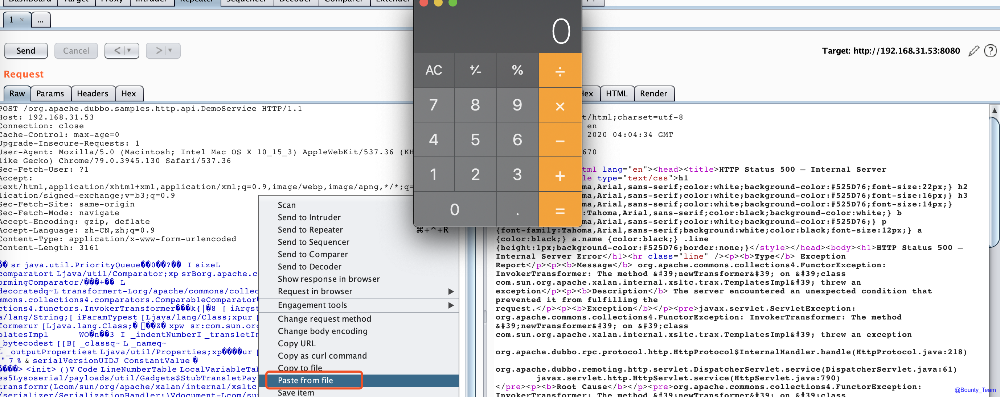
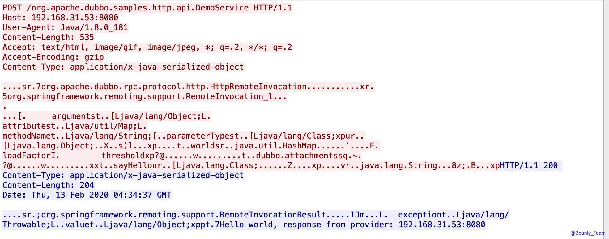
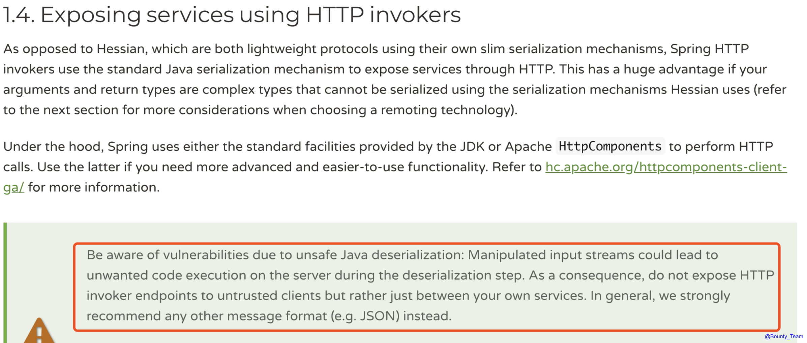
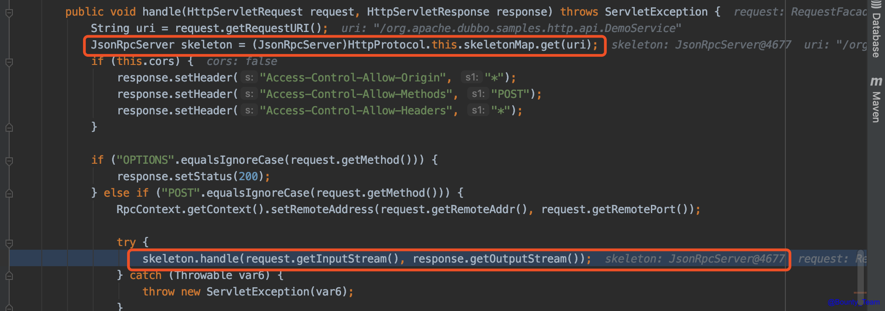

## 漏洞描述

> Unsafe deserialization occurs within a Dubbo application which has HTTP 
> remoting enabled. An attacker may submit a POST request with a Java object in 
> it to completely compromise a Provider instance of Apache Dubbo, if this 
> instance enables HTTP.

上面这部分是官方描述，也就是说当HTTP remoting 开启的时候，存在反序列化漏洞。有一点在描述中值得注意的，也就是说它影响不只是dubbo，还有spring-web（5.1.9.RELEASE）之前。

```
This vulnerability can affect users using Dubbo-Rpc-Http (2.7.3 or lower) and 
Spring-Web (5.1.9.RELEASE or lower).
```

影响版本：

- Dubbo 2.7.0 to 2.7.4
- Dubbo 2.6.0 to 2.6.7
- Dubbo all 2.5.x versions 

## 环境搭建

[下载地址](https://github.com/apache/dubbo-samples/tree/master/java/dubbo-samples-http)

把 **dubbo-samples-http** 这个demo下载下来，然后修改部分内容，首先将 **pom.xml** 文件中的 **dubbo.version** 修改为 **2.7.3** 版本。


其次在 **pom.xml** 文件中加入反序列化的 **gadget** ，为了方便，我选择了 **CC2** 的利用链中的 **commons-collections4** 

```
<!-- https://mvnrepository.com/artifact/org.apache.commons/commons-collections4 -->
<dependency>
    <groupId>org.apache.commons</groupId>
    <artifactId>commons-collections4</artifactId>
    <version>4.0</version>
</dependency>
```

由于 **dubbo** 和 **zookeeper** 还有关系，所以搭建环境的时候需要安装这个，并且启动。当这些一切就绪之后启动demo中的`org/apache/dubbo/samples/http/HttpProvider`。

## 漏洞利用

```
$ java -jar ysoserial-master-55f1e7c35c-1.jar CommonsCollections2 "open /System/Applications/Calculator.app" > payload.ser
```


## 漏洞分析

从右图中的报错调用栈其实很明显定位到了最开始入口是`javax.servlet.http.HttpServlet.service`。


在`javax.servlet.http.HttpServlet.service`处下个断点，可以看到这个地方处理HTTP请求进来的 **request** 和 **response** 。


然后进入到`org.apache.dubbo.remoting.http.servlet.DispatcherServlet`中，这里会有个判断，如果handler对象等于null，就返回404告诉对方，服务没有找到，否则继续调用相关对象的handle方法进行处理。


事实上这里dubbo支持这几种~~方式~~或者用协议来说更为合适，来进行数据的传输交互，而本次的处理HTTP协议的进入到自然是`org.apache.dubbo.rpc.protocol.http.HttpProtocol`这个类里面。


而在`org.apache.dubbo.rpc.protocol.http.HttpProtocol`这个类中，首先会判断请求方式是否是POST，不是的话会抛出500错误，其次就是从request对象中获取远程remoteAddr和remotePort，这个不多赘述，接着就进入`skeleton.handleRequest`进行处理。


跟进之后`skeleton.handleRequest`之后会发现调用的是 **spring** 的 **httpinvoker** ，其中 **readRemoteInvocation** 会处理我们传入的 **request** 对象。


继续跟进 **readRemoteInvocation** 会发现，它返回的是`RemoteInvocation.readRemoteInvocation`的处理结果。


继续跟进`RemoteInvocation.readRemoteInvocation`

调用 **RemoteInvocationSerializingExporter#doReadRemoteInvocation** 来针对数据流进行处理。


跟进 **RemoteInvocationSerializingExporter#doReadRemoteInvocation** ，反序列化入口就在这里了。


实际上可以看到的一点就是，**dubbo**在进行HTTP协议做数据传输的时候，走的是Java序列化，我通过wireshark抓了一个包，相信这个大家一定不陌生，从 `ContentType: application/x-java-serialized-object` 和报文 Body 部分的 ASCII 码可以看出，使用的是  **Java Serialize** 序列化，而这部分功能的实现使用的自然是 **spring** 的**httpinvoker** 功能。



细看 **spring** 的[docs](https://docs.spring.io/spring/docs/5.0.4.RELEASE/spring-framework-reference/integration.html#remoting-httpinvoker-server)，也做了下图可能存在反序列化的风险提示。



## 漏洞修复

前面说过dubbo的http处理是通过`org.apache.dubbo.rpc.protocol.http.HttpProtocol`，然后是实例化一个JsonRpcServer对象skeleton来处理uri，紧接着调用 **skeleton.handle** 
也就是`com.googlecode.jsonrpc4j.JsonRpcBasicServer#handle`



在`com.googlecode.jsonrpc4j.JsonRpcBasicServer#handle`当中没办法处理我们传输Java序列化字节流，因此就会抛出异常，也就是说这里的`org.apache.dubbo.rpc.protocol.http.HttpProtocol`后续处理不是通过**spring httpinvoker** 了，而是通过 **jsonrpc** 。


wireshark再抓个包确认一下，嗯，确实是这样。


## reference

https://www.mail-archive.com/dev@dubbo.apache.org/msg06225.html

https://www.cnkirito.moe/dubbo-http-protocol/