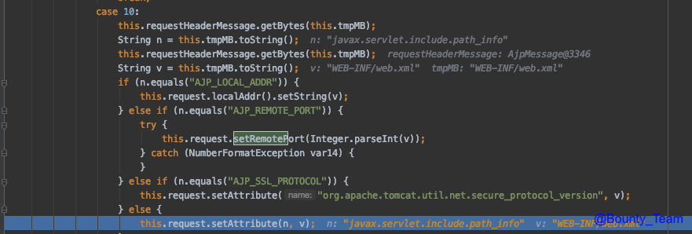
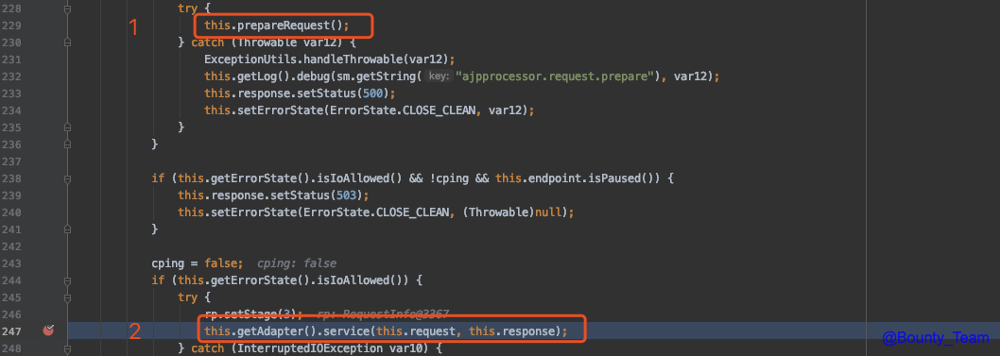
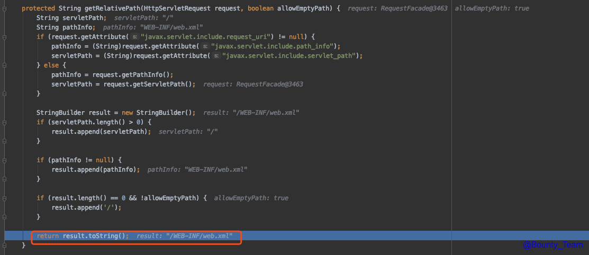

## 0x01 漏洞通告

2020年1月6日，国家信息安全漏洞共享平台（CNVD）收录了由北京长亭科技有限公司发现并报送的Apache Tomcat文件包含漏洞（CNVD-2020-10487，对应CVE-2020-1938）。攻击者利用该漏洞，可在未授权的情况下远程读取特定目录下的任意文件。目前，漏洞细节尚未公开，厂商已发布新版本完成漏洞修复。

## 0x02 漏洞分析

由于 **AJP** 并不是一个 **HTTP** 业务流，走的是 **Socket** ，所以 **tomcat** 前面接收业务流的时候调用的是一个 **Socket** 解析类 **SocketProcessorBase#dorun** 来处理 **ajp** 传入的二进制流。


而后面这部分的数据流实际上都是 **socket** 内部进行流传处理。


这里需要感谢 **tomcat** 优雅的代码风格，可读性真强，和 **socket** 相关的 **service** 就下图里面的这些，所以AJP的业务流自然就落在了`org/apache/coyote/ajp/AjpProcessor#service`这个方法上面进行处理。


这`org/apache/coyote/ajp/AjpProcessor#service`这个方法里面就留两个关键部分，其他代码太繁杂了，无关大雅，这里首先`this.prepareRequest()`方法是针对整个业务流进行预处理。

```java
    public SocketState service(SocketWrapperBase<?> socket) throws IOException {
      ...
        while(!this.getErrorState().isError() && !this.endpoint.isPaused()) {
            try {
              ...
            if (this.getErrorState().isIoAllowed()) {
                rp.setStage(2);

                try {
                    this.prepareRequest();
                } catch (Throwable var12) {
							...
            if (this.getErrorState().isIoAllowed()) {
                try {
                    rp.setStage(3);
                    this.getAdapter().service(this.request, this.response);
                } 
              ...
    }

```

跟进 **prepareRequest** 方法，这个方法会进行一个 **while** 为 **true** 的无限循环，根据`attributeCode`的结果进行选择，命中 **case 10** 核心中有个`request.setAttribute(n, v)`方法，这个方法会从我们之前设置方法中取值，设置，遍历循环POC中的`javax.servlet.include.request_uri`，`javax.servlet.include.path_info`，`javax.servlet.include.servlet_path`这三个属性对应的值，并且通过PUT方法进行赋值。

```java
    private void prepareRequest() {
				...
        while(true) {
            byte attributeCode;
            while((attributeCode = this.requestHeaderMessage.getByte()) != -1) {
                switch(attributeCode) {
                ...
                case 10:
										...
                    } else {
                        this.request.setAttribute(n, v);
                    }
                    break;
```



好了，这里知道了在 **prepareRequest** 方法中核心是将三个值动态赋予我们想要的结果，再回到`org/apache/coyote/ajp/AjpProcessor#service`中，在经过 **prepareRequest** 方法处理之后来到的就是`getAdapter().service(this.request, this.response);`，这个 **serivce** 就是后续处理 **request** 对象和 **response** 对象了。



在 **org/apache/catalina/connector/CoyoteAdapter#service** 这个类中，主要是设置一些连接的时候一些属性，然后通过 **invoke** 反射方法，根据 **request** 对象和 **response** 对象进入后面的HTTP处理逻辑。


所以又回到了前面的老话，tomcat完善的代码结构，HTTP的逻辑服务处理，自然是落在了 **javax/servlet/http/HttpServlet#service** 当中。


### 任意文件读取

前面是整个 **AJP->HTTP** 整个过程，继续往下跟入，因为通过 **AJP** 转换之后，进行的是 **HTTP GET** 请求，所以来到的自然是是下图中代码位置。


跟进 **doGet** 自然来到之前安恒通告说的地方。


继续跟入 **serveResource**，首先 **getRelativePath** 从之前传入的 **request** 对象中获取 **path** 。


跟进 **getRelativePath** ，一眼就知道为什么要设置 **request_uri** 、**path_info** 、**servlet_path** 这三个属性了，通过路径的拼接，最后返回的 **servletPath** 为`/`，容器内部为 **/WEB-INF/web.xml** 的文件内容。



继续回到 **serveResource** 方法中 **getResource** 根据前面的 **path** 也就是 **/WEB-INF/web.xml** 进行资源获取。而这里是没办法`../`出去的，原因继续往下看。


在 **getResource** 当中有个 **validate** ，这个检查往后走会调用 **normalize** 进行目录遍历的检查，之后就是输出读到的内容了。


由于当前 **AJP** 出不了 **webapps** 目录，但是是可以做到任意目录下读的，比如我需要读 **/example/2.txt** 下的文件，只需要这样配置就好了。

```
    {'name':'req_attribute','value':['javax.servlet.include.request_uri','/examples']},
    {'name':'req_attribute','value':['javax.servlet.include.path_info',2.txt]},
    {'name':'req_attribute','value':['javax.servlet.include.servlet_path','/']},
    ])
```


附上任意文件读取的调用栈

```
serveResource:839, DefaultServlet (org.apache.catalina.servlets)
doGet:504, DefaultServlet (org.apache.catalina.servlets)
service:634, HttpServlet (javax.servlet.http)
service:484, DefaultServlet (org.apache.catalina.servlets)
service:741, HttpServlet (javax.servlet.http)
internalDoFilter:231, ApplicationFilterChain (org.apache.catalina.core)
doFilter:166, ApplicationFilterChain (org.apache.catalina.core)
doFilter:52, WsFilter (org.apache.tomcat.websocket.server)
internalDoFilter:193, ApplicationFilterChain (org.apache.catalina.core)
doFilter:166, ApplicationFilterChain (org.apache.catalina.core)
invoke:199, StandardWrapperValve (org.apache.catalina.core)
invoke:96, StandardContextValve (org.apache.catalina.core)
invoke:493, AuthenticatorBase (org.apache.catalina.authenticator)
invoke:137, StandardHostValve (org.apache.catalina.core)
invoke:81, ErrorReportValve (org.apache.catalina.valves)
invoke:660, AbstractAccessLogValve (org.apache.catalina.valves)
invoke:87, StandardEngineValve (org.apache.catalina.core)
service:343, CoyoteAdapter (org.apache.catalina.connector)
service:476, AjpProcessor (org.apache.coyote.ajp)
process:66, AbstractProcessorLight (org.apache.coyote)
process:808, AbstractProtocol$ConnectionHandler (org.apache.coyote)
doRun:1498, NioEndpoint$SocketProcessor (org.apache.tomcat.util.net)
run:49, SocketProcessorBase (org.apache.tomcat.util.net)
runWorker:1142, ThreadPoolExecutor (java.util.concurrent)
run:617, ThreadPoolExecutor$Worker (java.util.concurrent)
run:61, TaskThread$WrappingRunnable (org.apache.tomcat.util.threads)
run:745, Thread (java.lang)
```

### RCE

```
"HTTP/1.1" "/1.jsp" 127.0.0.1 localhost porto 8009 false "Cookie:AAAA=BBBB" "javax.servlet.include.request_uri:/","javax.servlet.include.path_info:1.txt","javax.servlet.include.servlet_path:/upload/"
```

`org/apache/jasper/servlet/JspServlet#service`负责处理`xxx.jsp`访问逻辑，跟进来 **jspUri** 是通过 **servlet_path** 和 **path_info** 拼接而来的。


之后便会进入 **serviceJspFile** 逻辑进行处理。


跟进 **serviceJspFile** 方法，首先先通过 **getResource** 获取上传文件的内容，然后再通过初始化 **wrapper** 对象传入相关参数，然后再调用 **JspServletWrapper#service** 进行解析。


这简单解释一下，**RCE** 的核心需要进入的 **JspServlet** ，我们平常访问 **xxx.jsp** 是进入到 **Jspservlet** ，poc中访问`/1.jsp`通过 **AJP** 发包的过程中实际上就是我们的Get请求访问`www.xxx.com/1.jsp`，所以这里自然进入了 **JspServlet** 当中，然后再配合 **getResource** 获取上传的文件内容，调用 **Jsp** 引擎进行解析，自然达到了RCE的效果。

最后附上RCE的调用栈

```
exec:347, Runtime (java.lang)
_jspService:1, _1_txt (org.apache.jsp)
service:70, HttpJspBase (org.apache.jasper.runtime)
service:741, HttpServlet (javax.servlet.http)
service:476, JspServletWrapper (org.apache.jasper.servlet)
serviceJspFile:386, JspServlet (org.apache.jasper.servlet)
service:330, JspServlet (org.apache.jasper.servlet)
service:741, HttpServlet (javax.servlet.http)
internalDoFilter:231, ApplicationFilterChain (org.apache.catalina.core)
doFilter:166, ApplicationFilterChain (org.apache.catalina.core)
doFilter:52, WsFilter (org.apache.tomcat.websocket.server)
internalDoFilter:193, ApplicationFilterChain (org.apache.catalina.core)
doFilter:166, ApplicationFilterChain (org.apache.catalina.core)
invoke:199, StandardWrapperValve (org.apache.catalina.core)
invoke:96, StandardContextValve (org.apache.catalina.core)
invoke:493, AuthenticatorBase (org.apache.catalina.authenticator)
invoke:137, StandardHostValve (org.apache.catalina.core)
invoke:81, ErrorReportValve (org.apache.catalina.valves)
invoke:660, AbstractAccessLogValve (org.apache.catalina.valves)
invoke:87, StandardEngineValve (org.apache.catalina.core)
service:343, CoyoteAdapter (org.apache.catalina.connector)
service:476, AjpProcessor (org.apache.coyote.ajp)
process:66, AbstractProcessorLight (org.apache.coyote)
process:808, AbstractProtocol$ConnectionHandler (org.apache.coyote)
doRun:1498, NioEndpoint$SocketProcessor (org.apache.tomcat.util.net)
run:49, SocketProcessorBase (org.apache.tomcat.util.net)
runWorker:1142, ThreadPoolExecutor (java.util.concurrent)
run:617, ThreadPoolExecutor$Worker (java.util.concurrent)
run:61, TaskThread$WrappingRunnable (org.apache.tomcat.util.threads)
run:745, Thread (java.lang)
```

**后话**

我试了一下jsp的文件包含，这个demo下也是可以的，所以实际上RCE就是jsp的文件包含搞的鬼，要先上传一个文件，这个文件路径可被包含，然后读取模版解析，最后RCE。

```
//1.jsp
<%@ page language="java" import="java.util.*" pageEncoding="UTF-8" %>
<%@ include file="1.txt" %>

//1.txt
<%@ Runtime.getRuntime().exec("open /System/Applications/Calculator.app");%>
```

另外前面可能有师傅会问为什么是GET，原因是下面这个POC有`forwardrequest 2`，根据AJP数据包格式`第6个字节(02)代表是Get请求`。另外在Tomcat中也有相关映射关系，在 **AjpProcessor** 做 **prepareRequest** 处理的时候会根据字节选择相关的请求方式。


## 0x03 漏洞修复

网上都有修复方式了，一种是禁用AJP，另一种就是升级到最新。